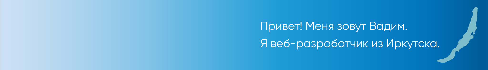

    

Добро пожаловать на мой GitHub. Здесь собраны ссылки на проекты для портфолио.

### 💵 Коммерческие проекты
| Описание          | Технологии  | Результат        |
| ----------------- | ----------- | ---------------- |
| Сайт тренера по эмоциональному развитию | HTML, Sass/SCSS, JavaScript (ES5), PHP, Wordpress | [Сайт «Ksenia V. Krivor»](https://kseniakrivor.com/) |
| Сайт услуг по размещению наружной рекламы | HTML, SVG, Sass/SCSS, JavaScript (ES5), PHP, Wordpress | [Сайт «Манифест»](https://manifeste.ru/) |

### ⚡ Тренировочные проекты
| Исходный код  | Описание          | Технологии  | Результат        |
| ------------- | ----------------- | ----------- | ---------------- |
| [YES](https://github.com/owlrik/markup-yes/) | Лендинг курса языковой школы | HTML, Sass/SCSS, JavaScript (ES6) | [Лендинг «YES»](https://owlrik.github.io/markup-yes/) |
| [Swedish Bitter](https://github.com/owlrik/markup-swedish-bitter/) | Лендинг бальзама для здоровья | HTML, Sass/SCSS, JavaScript (ES6) | [Лендинг «Swedish Bitter»](https://owlrik.github.io/markup-swedish-bitter/) |
| [Ask it!](https://github.com/owlrik/markup-askit/) | Лендинг платформы для организации мероприятий | HTML, Sass/SCSS, JavaScript (ES6) | [Лендинг «Ask it!»](https://owlrik.github.io/markup-askit/) |
| [Пинк](https://github.com/owlrik/markup-pink/) | Сайт приложения для раскрашивания серых будней в розовый цвет | HTML, Sass/SCSS, JavaScript (ES6) | [Сайт «Пинк»](https://owlrik.github.io/markup-pink/) |

### 💌 Буду рад рассмотреть ваши предложения к сотрудничеству

    &nbsp;&nbsp;
    

